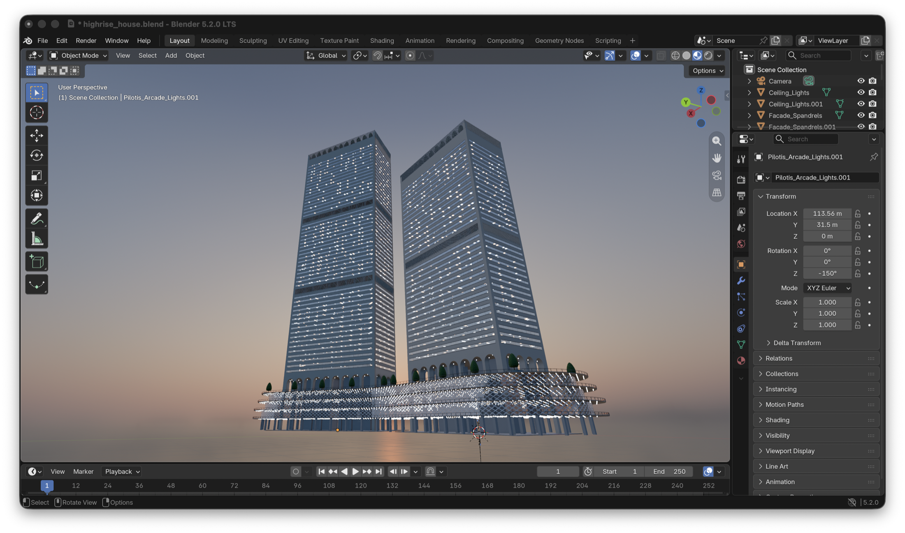
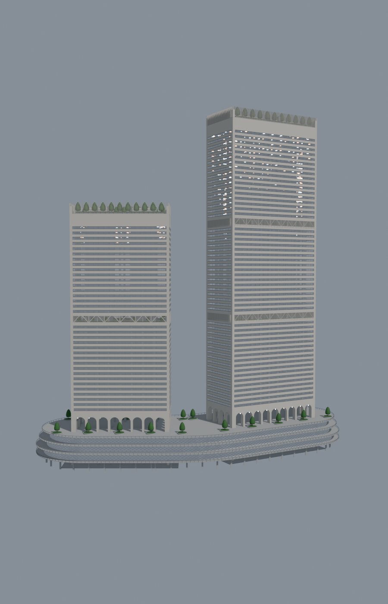
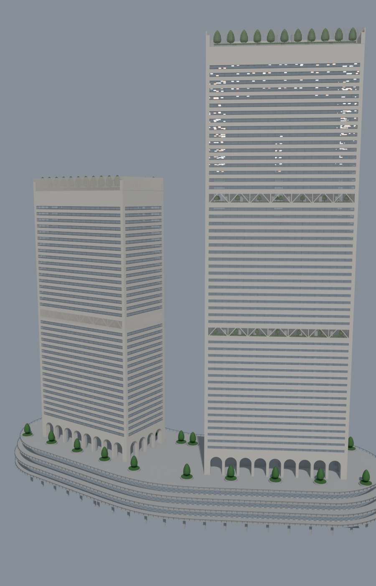
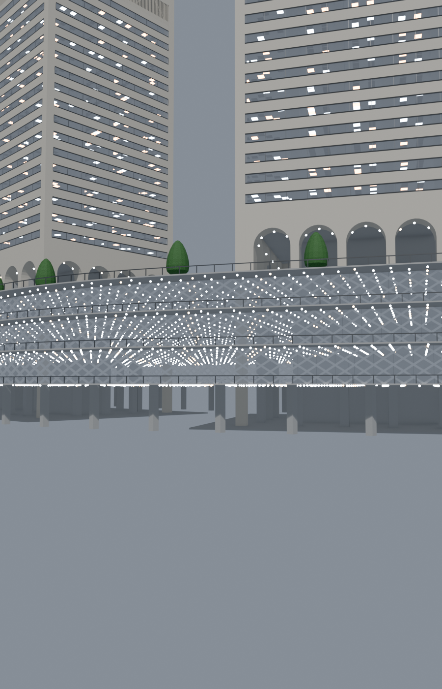
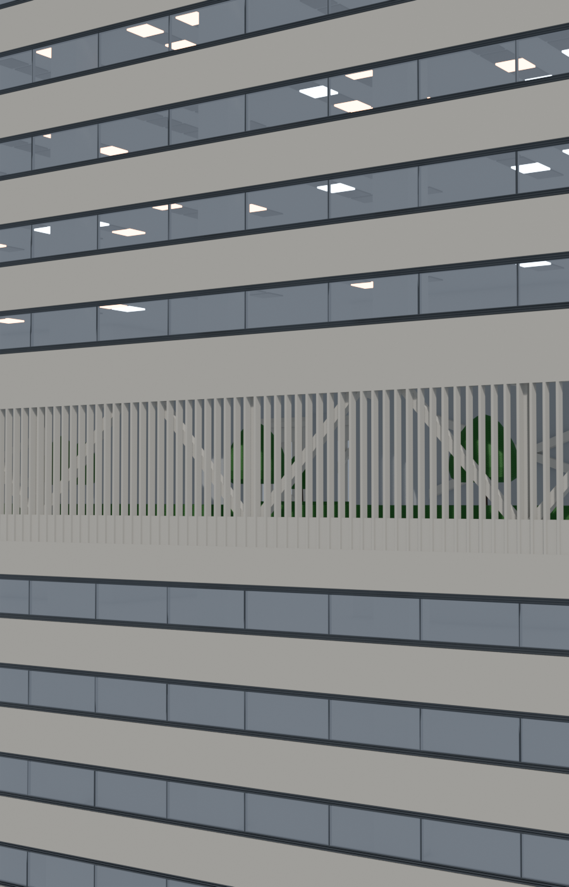
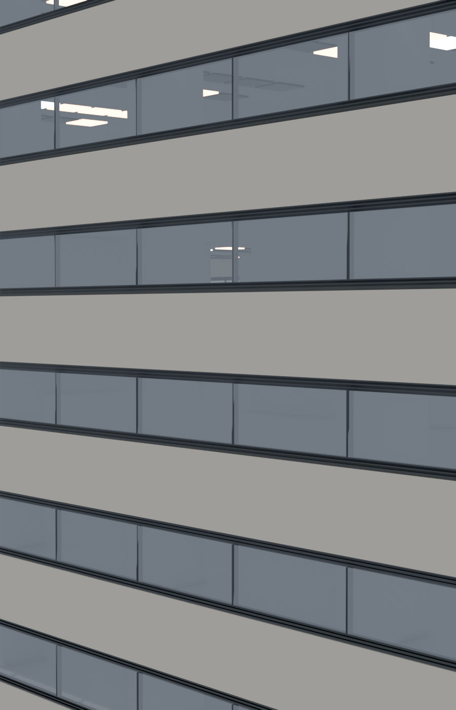

# Highrise House

一个以参数化建模方式制作的高层公寓综合体。项目由两栋独立的住宅塔楼、连续的曲线形玻璃裙房、架空层、空中花园和屋顶绿化组成，重点探索高层住宅的立面节奏、公共空间和结构表达。



上图为当前 Blender 场景的工作视角；下面的图片来自同一份已保存的 `.blend` 场景的重新渲染。

## 项目概览

| 项目 | 规格 |
| --- | ---: |
| 塔楼数量 | 2 栋 |
| 既有塔楼 | 76 × 40 m，约 193.94 m 至核心筒顶部 |
| 相邻塔楼 | 84 × 40 m，约 269.94 m 至核心筒顶部 |
| 塔楼间净距 | 30 m |
| 标准层高 | 4 m |
| 住宅立面模块 | 4 × 1.5 m 窗格模块 |
| 裙房深度 | 60 m |
| 渲染引擎 | Blender EEVEE |

## 设计特征

- **双塔住宅体量**：两栋塔楼保持各自的层数、房间模数和核心筒配置，形成高低错落的天际线。
- **连续曲线裙房**：裙房沿两栋塔楼和中部连接段连续展开，中心转折采用 120° 圆弧，避免分离的矩形翼楼和突兀的三角缺口。
- **架空公共首层**：底部保留通透的 pilotis 空间，塔楼从柱网中抬起；上部设置连续的公共平台、栏杆和环形步行界面。
- **立面节奏**：浅色石材墙体、深色金属竖梃与中性透明玻璃形成水平带状立面。窗、通风百叶和墙面保持在同一立面平面上。
- **空中花园 / 避难层**：塔楼中部设置双层高开放空间，以竖向格栅、种植和栏杆形成通风的天空花园，同时保留清晰的核心筒与外围结构表达。
- **屋顶绿化**：塔楼和裙房屋顶配置低矮绿化与景观边界，作为高层体量的收束。
- **可见的结构逻辑**：两座服务核心筒贯通塔楼，并在相邻塔楼的空中花园位置加入外露的桁架和 outrigger 表达。

## 主要视图

| 总体正立面 | 转角视图 |
| --- | --- |
|  |  |
| 两栋塔楼、塔间净距、裙房和屋顶绿化的整体关系。 | 展示两组不同宽度的立面模数，以及裙房连续曲线的转折。 |

| 架空裙房 | 空中花园 |
| --- | --- |
|  |  |
| 关注首层柱廊、公共平台、栏杆和裙房下方的通透空间。 | 关注双层高花园、竖向格栅、种植和塔楼核心筒之间的关系。 |

| 立面细节 |
| --- |
|  |
| 玻璃、通风带、水平墙带和室内灯光模块的近距离观察。 |

## 文件结构

```text
build_house.py       # 住宅双塔、裙房和场景的参数化生成
build_office.py      # 独立的办公塔楼生成脚本
materials.py         # 石材、玻璃、金属、灯光和植物材质
render_views.py      # 批量渲染项目展示视图
verify_house.py      # 对几何、立面模数和场景设置进行校验
floor_plan.py        # 平面图输出
open_in_blender.py   # 打开场景并启用材质预览
view.sh              # 快速打开已保存的 Blender 场景
out/                 # 本地构建产物，默认不纳入 Git
docs/images/         # README 使用的项目展示图
```

## 使用方法

需要 Blender 5.x，当前项目使用 Blender 5.2.0 LTS 开发。

### 生成场景

```bash
blender --background --factory-startup --python build_house.py
```

生成内容写入 `out/`：

- `highrise_house.blend`：完整可编辑场景
- `highrise_house.glb`：用于 Web 或其他 DCC 工具的 glTF 文件
- `preview.png`：总体预览图

如果只需要生成模型而不渲染，可以追加 `--no-render`。

### 打开 Blender 场景

```bash
./view.sh
```

脚本会直接打开 `out/highrise_house.blend`，并把 3D 视图切换到 Material Preview，避免 Blender 默认的 Solid 模式把材质显示成统一灰色。

### 重新渲染展示图

```bash
blender --background --factory-startup --python render_views.py -- out/highrise_house.blend
```

展示图默认输出到 `out/`。README 中的图片是从当前场景复制到 `docs/images/` 的项目快照，因此 GitHub 在不依赖 Release 附件的情况下也能直接显示项目效果。

### 运行校验

```bash
blender --background --factory-startup --python verify_house.py -- out/highrise_house.blend
```

校验脚本覆盖塔楼尺寸、楼层和窗格模数、玻璃立面、核心筒、空中花园、裙房连续性、架空层净空以及保存后的视图设置。当前保存场景包含后期调整过的三层玻璃裙房和桁架高度，旧版校验规则仍会报告对应断言；这些结果应视为待同步的基线，而不是一次全绿验证。

## 参数化建模

项目的关键尺寸由窗格数量、标准层高和住宅组数推导，而不是手动堆叠固定体量。例如，长边每增加一个 4 m 窗格模块，塔楼宽度就增加 4 m；改变住宅组数后，楼层、核心筒顶部、空中花园位置和相机取景会一起更新。

住宅塔楼的核心配置位于 `build_house.py` 的 `configure_tower()` 调用中：

```python
configure_tower(2, 18, core_column_bays=2)  # 既有塔楼
configure_tower(3, 20, core_column_bays=3)  # 相邻塔楼
```

材质集中在 `materials.py`，默认使用暖色浅石材、透明玻璃、深色阳极氧化金属和低饱和深绿色植物。玻璃保持透明和低粗糙度，室内灯光通过分散的天花灯模块表现居住感，而不是在玻璃后面增加一层发光幕墙。

## 状态

当前场景已保存为 `out/highrise_house.blend`，README 展示图已根据当前 Blender 场景重新截取和渲染。构建和批量渲染流程可重复执行；验证脚本可运行，但其中部分裙房与桁架断言仍以旧版场景为基线，尚待同步。
