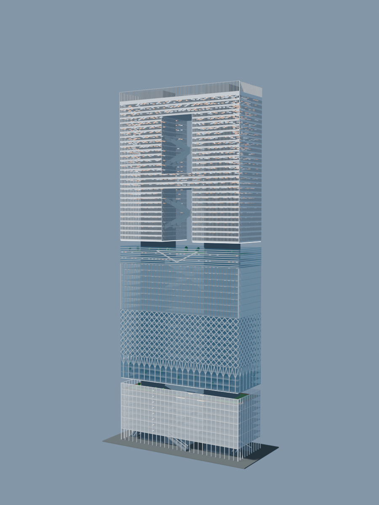
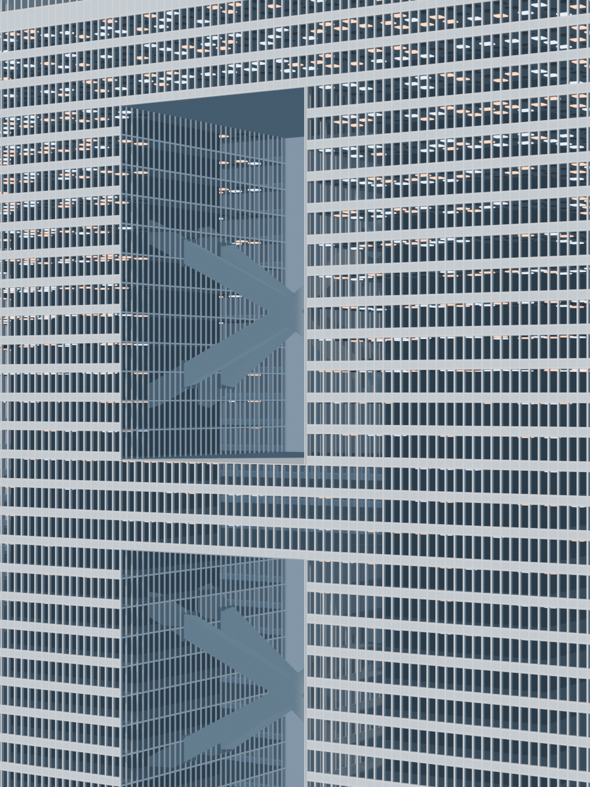
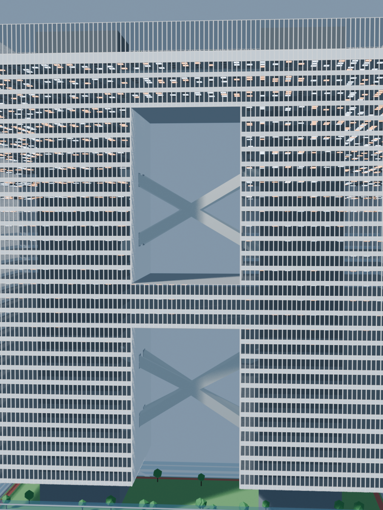
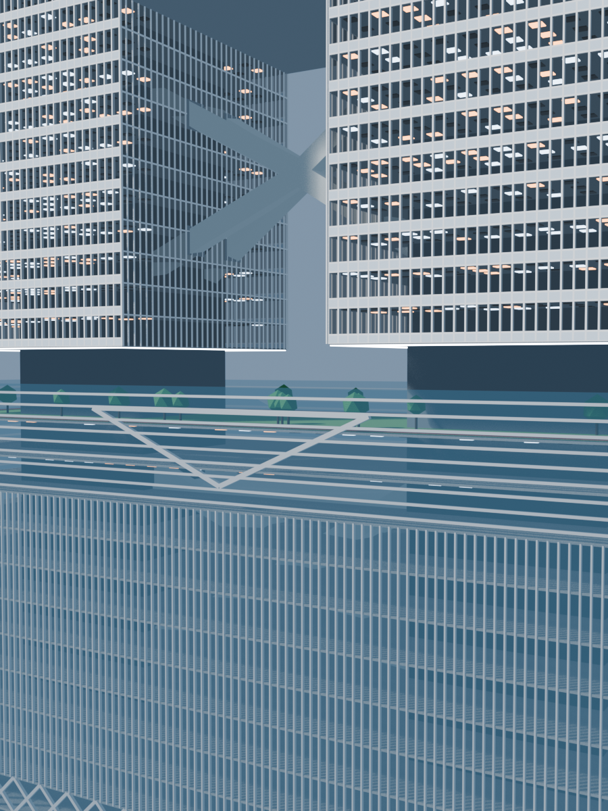
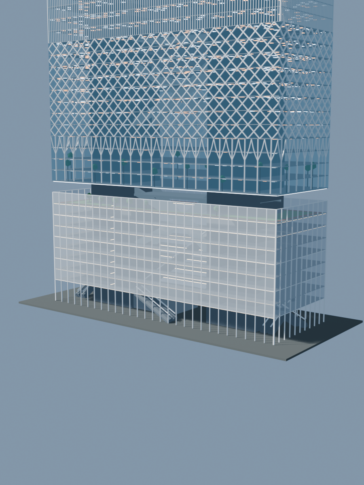

# Highrise House

A procedural Blender model of a high-rise residential complex composed of two independently configured apartment towers, a continuous curved glass podium, open pilotis levels, sky gardens, and landscaped roofs. The project explores facade rhythm, public space, structure, and lighting at the scale of a dense vertical development.


The image above captures the current Blender working view. The images below are rendered from the same saved `.blend` scene.

## Project Overview

| Item | Specification |
| --- | ---: |
| Towers | 2 |
| Existing tower | 76 × 40 m; approximately 193.94 m to the core top |
| Adjacent tower | 84 × 40 m; approximately 269.94 m to the core top |
| Clear gap between towers | 30 m |
| Typical floor-to-floor height | 4 m |
| Residential facade module | 4 × 1.5 m window module |
| Podium depth | 60 m |
| Render engine | Blender EEVEE |

## Design Features

- **Twin residential towers:** each tower keeps its own height, room-module count, and service-core configuration, producing an asymmetrical skyline.
- **Continuous curved podium:** the podium extends beneath both towers and across the connector, using a smooth 120-degree central arc rather than disconnected rectangular wings.
- **Open public base:** pilotis lift the towers above a permeable ground level, while elevated galleries, guardrails, and planted terraces form a continuous public edge.
- **Horizontal facade rhythm:** pale stone bands, dark metal mullions, and neutral clear glass create long ribbon elevations. Windows, ventilation bands, and wall surfaces remain flush on one facade plane.
- **Sky gardens and refuge floors:** double-height openings combine vertical screens, planting, balustrades, exposed cores, and perimeter structure.
- **Landscaped roofs:** low planting and perimeter screens terminate both tower and podium volumes.
- **Legible structure:** twin service cores continue through each tower, with exposed trusses and outrigger elements marking the taller tower's sky-garden levels.
- **Layered lighting:** deterministic warm and cool room lights create a scattered, star-like pattern behind the glazing, while dense circular fixtures illuminate the podium soffits and pilotis arcades.

## Main Views

| Ground-Up Twin-Tower View | Ground-Up Podium Corner |
| --- | --- |
|  |  |
| The camera sits at ground level and looks steeply upward between both towers, emphasizing their height and scattered interior lights. | A second ground-level camera looks upward from the podium corner, placing the illuminated soffit, pilotis, and both towers in the same frame. |

| Podium and Pilotis | Sky Garden |
| --- | --- |
|  |  |
| A close view of the open base, columns, public galleries, guardrails, and illuminated podium underside. | The double-height planted refuge level, vertical screen, glazing, and structural frame. |

| Facade Detail |
| --- |
|  |
| Clear glazing, ventilation strips, horizontal spandrels, mullions, and the varied interior-light modules seen at close range. |

## The Stack

A second, independent procedural study in this repository: an image-led approximation of MVRDV's *The Stack* competition proposal, built by `build_the_stack.py`. It is a slender 115 × 40 m slab rising to 301.8 m, read as a vertical stack of horizontal neighbourhood bands — a double-height retail hall, garden, diagrid, fin, louvre and masonry bands — pierced by one large apartment void with a three-storey bridge, held by two service cores braced by giant X-braces, and crowned by a planted roof inside an open glazed edge.

| Whole building | Apartment curtain wall |
| --- | --- |
|  |  |

| Apartment void | Refuge sky garden |
| --- | --- |
|  |  |

| Retail base |
| --- |
|  |

Build, render the review views and validate it with:

```bash
blender --background --factory-startup --python-exit-code 1 --python build_the_stack.py
blender --background --factory-startup --python-exit-code 1 --python build_the_stack.py -- --views preview facade garden void base
blender --background --factory-startup --python-exit-code 1 --python verify_the_stack.py -- out/the_stack.blend
```

## Repository Structure

```text
build_house.py       # Procedural generation of the residential towers and podium
build_office.py      # Separate procedural office-tower study
materials.py         # Stone, glass, metal, lighting, and planting materials
render_views.py      # Batch rendering of presentation views
verify_house.py      # Geometry, facade-module, and scene validation
floor_plan.py        # Floor-plan output
open_in_blender.py   # Opens the scene in Material Preview
view.sh              # Convenience command for opening the saved Blender scene
out/                 # Local build products; ignored by Git
docs/images/         # Images displayed in this README
```

## Usage

Blender 5.x is required. The project is currently developed with Blender 5.2.0 LTS.

### Build the Scene

```bash
blender --background --factory-startup --python build_house.py
```

The build writes the following files to `out/`:

- `highrise_house.blend`: the complete editable scene
- `highrise_house.glb`: a glTF export for web and other DCC viewers
- `preview.png`: the overall preview render

Append `--no-render` to generate the model without rendering the preview.

### Open the Scene

```bash
./view.sh
```

This opens `out/highrise_house.blend` and switches the 3D viewport to Material Preview. Blender's default Solid mode ignores the project materials and otherwise displays the model as a flat grey mass.

### Render Presentation Views

```bash
blender --background --factory-startup --python render_views.py -- out/highrise_house.blend
```

The renderer writes all views to `out/`, including two reproducible ground-level upward views. The README images are repository snapshots stored in `docs/images/`, allowing GitHub to display the project without relying on external release assets.

### Run Validation

```bash
blender --background --factory-startup --python verify_house.py -- out/highrise_house.blend
```

The verifier checks tower dimensions, floor and window modules, glazing, service cores, sky gardens, podium continuity, pilotis clearance, and saved viewport settings. The current saved scene includes later three-level podium and truss-height adjustments, so several older assertions still report baseline mismatches and need to be synchronized with the latest design.

## Parametric Model

Key dimensions are derived from window count, floor height, and residential-group count instead of being assembled as fixed masses. Adding one 4 m module to a long facade increases the corresponding tower width by exactly 4 m. Changing the residential group count updates the floors, core tops, sky-garden positions, and camera framing together.

The two residential tower configurations are defined by the `configure_tower()` calls in `build_house.py`:

```python
configure_tower(2, 18, core_column_bays=2)  # Existing tower
configure_tower(3, 20, core_column_bays=3)  # Adjacent tower
```

Materials are centralized in `materials.py`. The default palette combines warm pale stone, neutral transparent glass, dark anodized metal, and subdued green planting. Interior depth comes from discrete ceiling fixtures with deterministic warm, cool, and off states rather than a uniformly emissive surface placed behind the glazing.

## Current Status

The current scene is saved as `out/highrise_house.blend`. The README imagery has been captured and rendered from that scene, including the two ground-level upward views. Scene building and batch rendering are reproducible; validation runs successfully but still contains several podium and truss assertions based on an earlier scene baseline.
